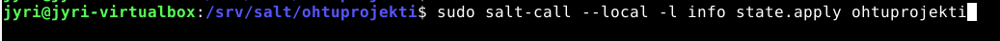
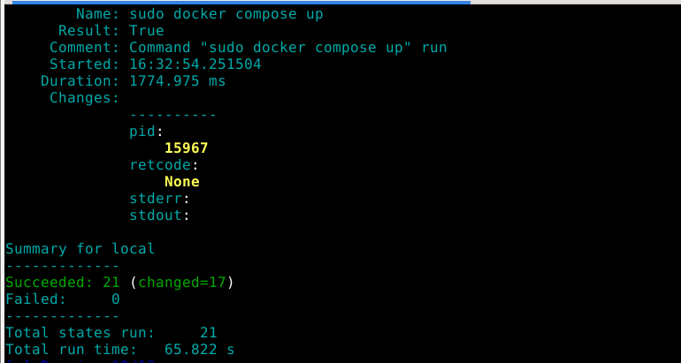
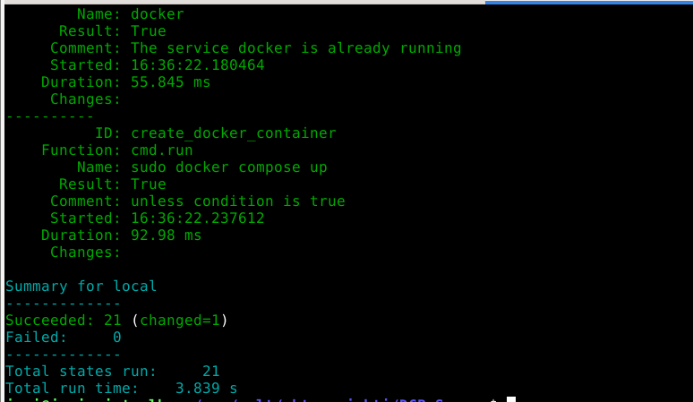
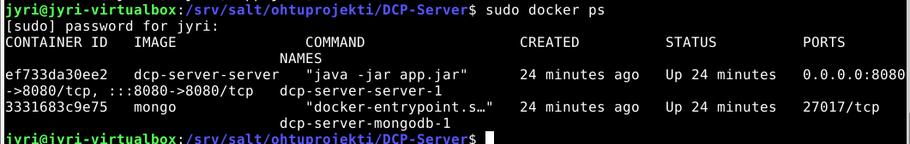
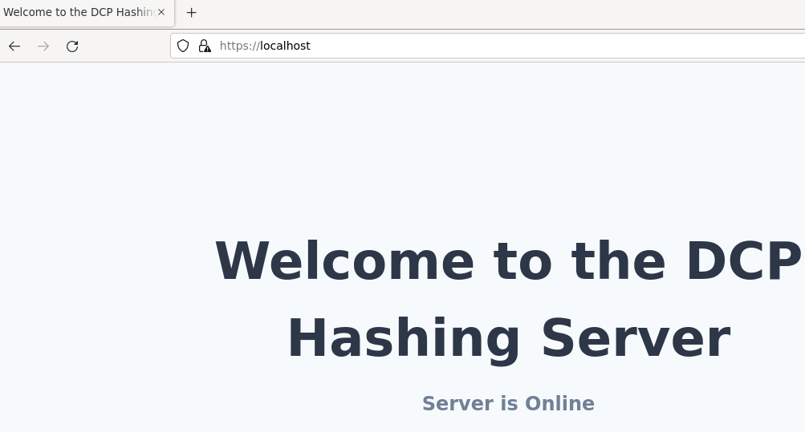

##### Jyri Lampio

# Saltstack.

The topic of my seminar was to automate the installation of Docker, Caddy and UFW and composing a project (mongodb and server) from a Dockerfile. I used Salt Project for this purpose. Salt is an "event-driven IT automation, remote task execution, and configuration management." The link for the salt project can be found *[here](https://saltproject.io/)*.

UFW is a simplified firewall configuration tool for Linux systems. It provides an easy-to-use command-line interface to manage firewall rules. 

Caddy is a lightweight web server and reverse proxy server. It is designed to be simple to use and configure while providing powerful features.

Docker is an open-source platform that enables developers to automate the deployment and management of applications inside software containers. Containers are lightweight and portable, allowing applications and their dependencies to be packaged together. Docker provides a way to create, distribute, and run containers consistently across different environments, such as development, testing, and production.

### Starting The Project

I decided to use a virtual machine to test this automation process. The initial idea for me was to use my rented server, but it turned out that it did not have enough resources to run docker and building the application so I decided just to use a Debian based virtual Machine. If someone does not know how to install a virtual machine and is interested on how to do it here is a *[tutorial](https://jyridoingthings.wordpress.com/2022/01/23/etcetera/)* for the installation process.

Once the installation was finished I installed a Salt minion on my virtual machine by running the command:

	sudo apt-get -y install salt-minion

Once that was done, I started to create the init.sls file. You can use whatever text editor you want. I did mine vith Visual Studio Code, but a normal text editor will do fine as well. You need to create a salt directory to /srv/salt/ This the main directory where all the project directories should be placed. Inside the salt directory you can create multiple directories with unique names and create the init.sls file inside those. The salt file can be run locally with a command

	sudo salt-call --local -l info state.apply "Directoryname"

### Creating Salt States

In this part I am going to show some salt states, and explain them, you can see the rest of the code in the repository. 

I started by creating my first salt state inside the init.sls file:

	install ufw:
	  pkg.installed:
	    - name: ufw

The first line "install ufw:" is the name of the state. It can be named anything, but it can also be the salt command (Will demonstrate this later). The pkg.installed is a command that ensures that a specific package is installed and the last line is the name of the pkg which is ufw.

The format of Salt commands, including the indentation with two spaces, is crucial as it determines the structure and execution of the commands in SaltStack configuration management, ensuring proper functionality and readability of the code. The internal commands in SaltStack, such as pkg.installed or service.running, are inherently idempotent, meaning they only take action if the desired state differs from the current state. In the context of configuration management, an idempotent operation, when executed multiple times, will have the same effect as if it were executed once, without causing unintended side effects or changes. However, when using cmd.run to execute arbitrary shell commands, you need to make them idempotent by using conditional statements or checks to prevent unnecessary or repetitive execution. 

	ufw allow 80/tcp:
	  cmd.run:
	    - unless: "ufw status verbose | grep '80/tcp'"

I mentioned earlier that the state can be named anything but it can also be the command directly. Here the name of the state "ufw allow 80/tcp" is also the command and as you can see there is no command executing command after the cmd.run. The "Unless" command refers to a making the state idempotent: It will only be executed if the ufw status verbose command does not have "80/tcp" in it meaning that the port 80 is not yet open.

### Creating a Caddyfile

Caddy is a web server that can be configured with a Caddyfile. I wanted to be able to access the server directly from localhost without needing to write the port to the url.

I created the following Caddyfile for this project:

	localhost {
	    reverse_proxy localhost:8080
	}

When someone access the localhost it directs the traffic to localhost:8080 therefore there is no need to write the port. I can copy the file to the minion computer with the following command:

	/etc/caddy/Caddyfile:
	  file.managed:
	    - source: salt://ohtuprojekti/Caddyfile

The caddyfile is located inside the /srv/salt/ohtuprojekti/ directory and when the state is run the file will be copied to /etc/caddy/ directory.

### Running the init.sls file

When it is time to run the init.sls file you can run it by

	sudo salt-call --local -l info state.apply ohtuprojekti

The ohtuprojekti in this case is the directory name I have given.

It might take some time to run it through especially when the docker installation and docker container creation takes some time, but once it is through you can see the results in the terminal. In the above image we can see that there were a total of 21 states and all of the states succeeded with 17 states changing something. It took 65 seconds to run it.

As I mentioned previously that the states should be idempotent, meaning they will only be run if there is changes, lets run the init.sls file again.

Here we can see that again 21 states succeeded, but only one change was made and total time of running was only 3.8 seconds. From this we can determine that 20 of my states are idempotent, which is also true. I was unable to make one state idempotent. 

### Results

Now when the init.sls run is finished, let's look at the results. I should have a two docker containers running and they should be accessible with a browser with a url Localhost.

As we can see there are now two docker containers running. One for mongodb and for the server. Let's browse to localhost to see if the Caddy web server is working correctly. 

And that seems to work as well!

### In Conclusion

I had experience using all the previous techonogies as I am running a home server running docker containers and Caddy web server for one website. I have done Salt states in one course and I liked it quite a bit so I decided to combine these three different technologies together.

The project ended up being a bit harder than expected, but with a help from the internet, I managed to create the project like I initially wanted. There were a bit too much arbitrary shell commands and too little internal Salt commands than I hoped for, but I managed to make majority of them idempotent so I think it was a decent end result for both.

### [Video](https://haagahelia-my.sharepoint.com/personal/bgo801_myy_haaga-helia_fi/_layouts/15/stream.aspx?id=%2Fpersonal%2Fbgo801_myy_haaga-helia_fi%2FDocuments%2FKazam_screencast_00006.mp4)

### Sources

- [SaltDocumentation](https://docs.saltproject.io/en/latest/contents.html). Luettu 10.05.2023.
- [Containerize Spring Boot Application](https://www.youtube.com/watch?v=-9c6EeUbzgQ). Katsottu 10.05.2023.
- ChatGPT
